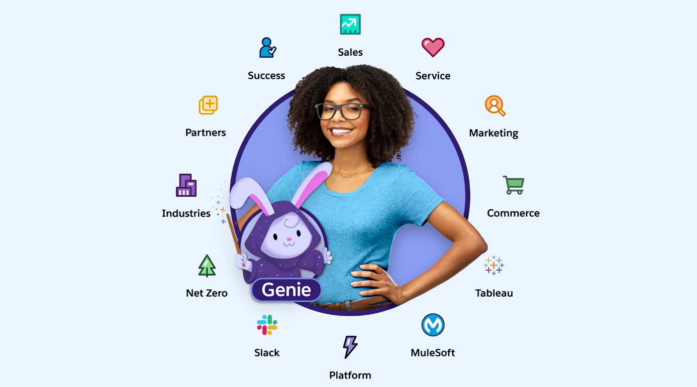
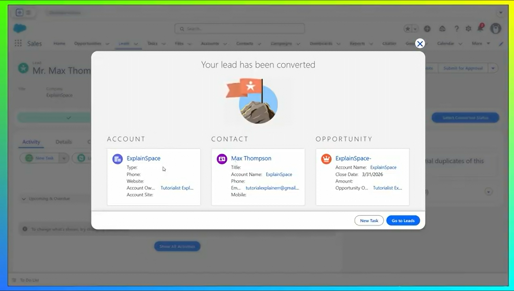
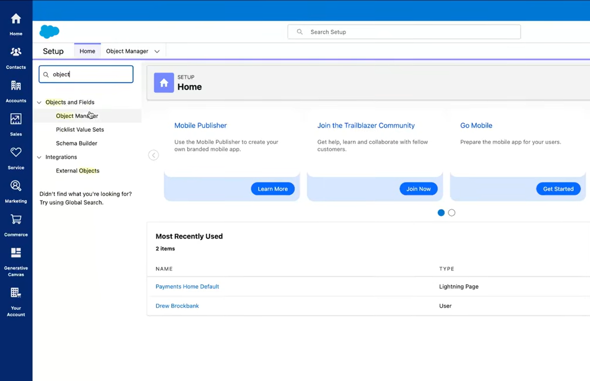

# Day 1: Salesforce CRM Basics
## 2. Why Companies Use Salesforce
Salesforce is the global leader in CRM because it offers more than just a database; it offers a complete ecosystem:
*   **Cloud-First Infrastructure:** No hardware or software installation is required.
*   **Scalability:** It works for small startups and global enterprises alike.
*   **Low-Code Innovation:** Tools like **Flow Builder** allow admins to automate complex business processes without writing code.
*   **Integrated AI:** With **Agentforce**, companies can deploy autonomous AI agents to handle customer inquiries instantly.

## 1. What is CRM?
**CRM (Customer Relationship Management)** is a centralized platform used to manage all company-customer interactions. It replaces fragmented tools like spreadsheets and personal inboxes with a single **"Customer 360"** view, ensuring every department sees the same real-time data.

* **The Goal:** To reduce technical complexity, lower IT costs (by up to 25%), and increase employee productivity.
* **The Impact:** 89% of customers see a positive ROI within their first year.

---

## 2. Platform Interface & Navigation
The Lightning Experience interface is designed for high productivity and quick access to data:

* **Home:** A customizable dashboard showing daily tasks, performance charts, and recent records.
* **Global Search:** Accessible via the forward slash (`/`) hotkey to find any record instantly.
* **App Launcher:** The "Waffle Icon" used to switch between apps like Sales, Service, or Marketing.
* **Setup:** The "Cog Wheel" area used for backend configurations and user management.

---

## 3. Core Objects (The Building Blocks)
Salesforce data is structured into **Objects**, which represent real-world business entities:

* **Leads:** Unqualified potential customers (the "dumping ground" for new inquiries).
* **Accounts:** The companies or organizations you do business with.
* **Contacts:** The individual people associated with those Accounts.
* **Opportunities:** Qualified business deals currently in progress.
* **Products:** The specific goods or services offered to customers.

---

## 4. The Sales Lifecycle: Lead to Opportunity
A core function of the CRM is moving interest through a defined pipeline.

1. **Nurturing:** Tracking interactions with a Lead to see if they meet business criteria (Budget, Authority, Need, and Timing).
2. **Conversion:** Once qualified, a Lead is "Converted." This action automatically creates three linked records: an **Account**, a **Contact**, and an **Opportunity**.

---

## 5. Automation & Pipeline Management
* **Kanban View:** A visual board to track deal progression through stages. It allows users to drag-and-drop deals to update their status instantly.
* **Flow Builder:** An automation tool used to create workflows (e.g., sending an automatic email when a Lead is created) without writing code.
* **Dashboards:** Visual charts and graphs that help leaders make data-driven decisions based on real-time reports.

---

## 6. Technical Configuration
For developers and admins, the backend of the system is managed through the **Object Manager**. This is where you define the data architecture, create custom fields, and manage how data relates across the entire organization.

## 4. Real-World Mapping: Campus Gadget Rental
To visualize how these objects function in a real-world scenario like my **Campus Gadget Rental** project:

| Salesforce Object | Project Entity | Description |
| :--- | :--- | :--- |
| **Account** | University Department | The organization owning or renting the gear (e.g., CSE Dept). |
| **Contact** | Student / Faculty | The specific individual renting the gadget. |
| **Lead** | Rental Inquiry | A student asking about camera availability via a web form. |
| **Opportunity** | Active Rental | A confirmed rental deal where the gadget is currently checked out. |
| **Custom Object** | Gadget Inventory | A specific table to track serial numbers, models, and condition. |

# Day 1: Salesforce Fundamentals

## 1. What problem does Salesforce solve?
Imagine a business where the sales team uses sticky notes, the marketing team uses spreadsheets, and the support team uses a different app entirely. Nobody knows what the other is doing, and the customer has to repeat their story every time they call.

**Salesforce solves the "fragmented data" problem.** It acts as a single, shared brain for a company. It ensures that everyone—from marketing to sales—is looking at the same information, stopping things from falling through the cracks.

---

## 2. What is CRM?
**CRM** stands for **Customer Relationship Management**. In simple terms, it’s a digital "address book" on steroids. Instead of just storing a phone number, it stores every interaction:
* Emails sent and received
* Products purchased
* Support complaints or feedback
* Customer preferences

**The Goal:** Use data to build better relationships so customers stay happy and keep coming back.

---

## 3. What is an Object in Salesforce?
If Salesforce were an Excel workbook, an **Object** would be one of the tabs at the bottom. It is essentially a database table designed to hold a specific type of information.

* **Example:** The **Lead Object**. Think of this as a digital bucket for "potential customers." When someone fills out a form, a new record is created here holding their name, company, and interests.

---

## 4. Salesforce Admin vs. Developer
Think of this like the difference between someone who assembles a car and someone who engines the parts from scratch.

| Role | Tools Used | Responsibilities |
| :--- | :--- | :--- |
| **Salesforce Admin** | "Point-and-Click" | Sets up users, creates reports, and builds automations using Flow. |
| **Salesforce Developer** | Code (Apex, JavaScript) | Builds custom features and complex integrations that don't exist out-of-the-box. |

---

## 5. Project Idea: Inventory & Rental Tracker
A great beginner project to practice these concepts is a **Campus Gadget Rental App**.

* **The Problem:** Students need equipment (cameras, laptops) but don't know what is available or when it is due back.
* **The Salesforce Solution:** * Create custom **Objects** for "Equipment" and "Rentals."
    * Build a **Flow** (automation) to email students reminders.
    * Use a **Dashboard** to see which items are most popular.
