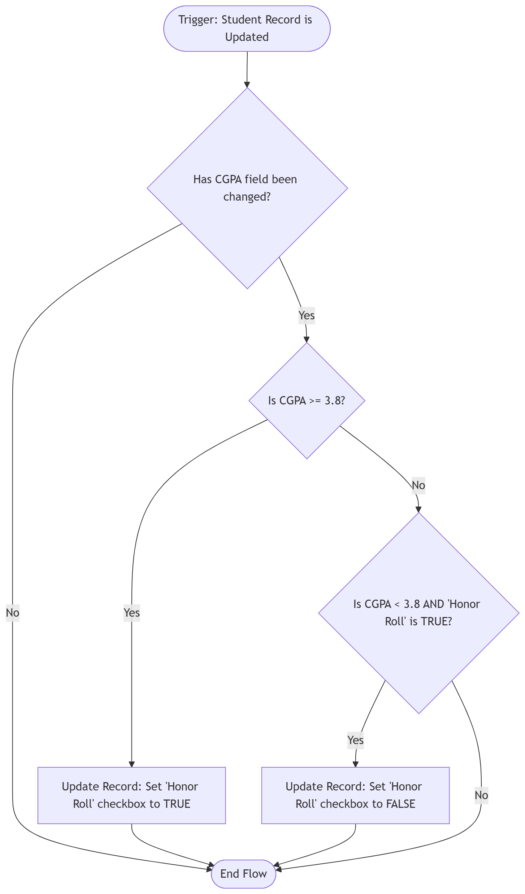

# **Day 4: Flow Builder**

## **1. Introduction to Flow Builder**

Flow Builder is Salesforce’s automation tool that allows users to automate business processes using a visual drag-and-drop interface. It helps reduce manual work by automating repetitive tasks without requiring extensive coding.

Flows can:
- Collect user input
- Create and update records
- Send notifications
- Execute business logic
- Automate approval processes

---

# **2. Types of Flows**

Salesforce provides different flow types based on the automation requirement.

## **Screen Flow**
Screen Flows interact directly with users through forms and screens. These are commonly used for guided processes and data collection.

## **Record-Triggered Flow**
These flows run automatically whenever a record is created, updated, or deleted.

## **Autolaunched Flow**
Autolaunched Flows run in the background without user interaction and are commonly used for backend automation.

## **Scheduled Flow**
Scheduled Flows execute automatically at a specified time and frequency.

---

# **3. Components of Flow Builder**

Flow Builder consists of multiple components that work together to create automation.

## **Elements**
Elements are the building blocks of a flow. They define what action the flow performs.

Examples:
- Create Records
- Update Records
- Decision
- Assignment
- Get Records

## **Connectors**
Connectors define the path that the flow follows during execution.

## **Resources**
Resources store and manage data inside the flow such as variables, formulas, and collections.

---

# **4. Building an Automated Student Registration Flow**

This flow automates the student registration process inside the college management system.

## **Flow Process**

1. Collect student details using a Screen Flow.
2. Validate the entered information.
3. Create a new Student record automatically.
4. Assign the student to a selected department.
5. Display a confirmation message after successful registration.

### **Student Registration Flow Execution**

---

# **5. Decision Elements and Logic**

Decision Elements allow flows to follow different paths based on conditions.

Example:
- If CGPA is greater than 3.5 → Eligible for Scholarship
- Otherwise → Regular Admission Process

This helps in implementing business rules dynamically within the automation process.

---

# **6. Debugging and Testing Flows**

Testing is an important step before activating any flow.

Salesforce provides a **Debug** option that allows developers and administrators to:
- Test different scenarios
- Identify errors
- Validate conditions
- Monitor flow execution step-by-step

Proper debugging ensures that the automation behaves correctly before deployment.

---

# **7. Reflection: Importance of Automation**

Automation improves efficiency by reducing repetitive manual tasks and minimizing human errors. With Flow Builder, organizations can automate complex business processes without writing large amounts of code.

Benefits of Flow Builder include:
- Faster business operations
- Reduced manual effort
- Improved accuracy
- Better process standardization
- Easier maintenance and scalability

Flow Builder has become one of the most important low-code automation tools in Salesforce because it combines flexibility with ease of use.
